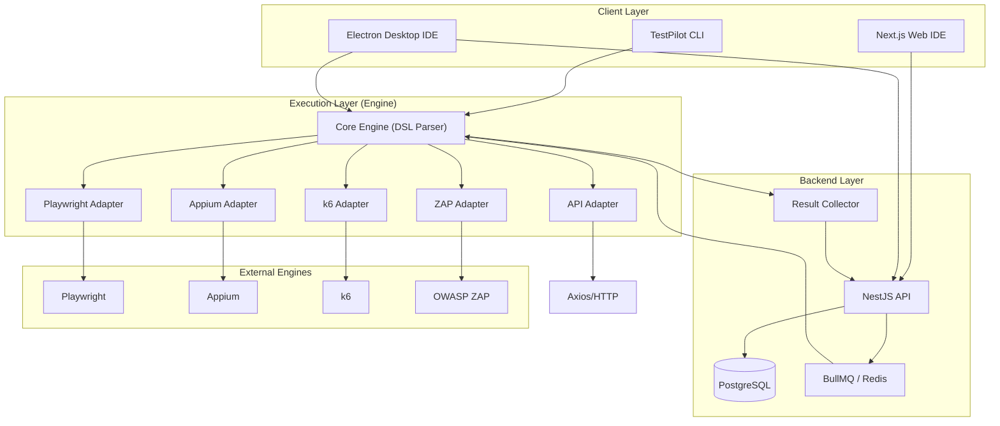

# TestPilot: Unified Software Testing Platform

TestPilot is a developer-first testing IDE/platform that unifies web, mobile, API, performance, and security testing under a single DSL and ecosystem.

## Vision
To eliminate tool fatigue by providing a single, cohesive interface for all testing needs, similar to how VS Code unified code editing.

## 🏗️ Architecture Overview

The system is built on a **Modular Adapter Pattern**. The core `engine` package parses your `pilot` DSL and delegates commands to specific adapters (Playwright, Appium, axios, etc.) based on the testing context.

### High-Level System Diagram



### Monorepo Structure (Turborepo + pnpm)
```
testpilot/
├── apps/
│   ├── web-ide (Next.js + React)
│   ├── desktop-ide (Electron + React)
│   ├── backend (NestJS + PostgreSQL)
│   └── cli (Commander.js)
├── packages/
│   ├── engine (Core DSL & Execution Engine)
│   ├── playwright-adapter (Web Automation)
│   ├── mobile-adapter (Appium / Mobile)
│   ├── api-testing (Axios/HTTP)
│   ├── load-testing (k6)
│   ├── security-scanner (OWASP ZAP)
│   ├── ui-components (Shared Design System)
│   ├── reporter (Logs & Results)
│   └── types (Shared Interfaces)
└── turbo.json
```

## 🗺️ Milestone-Based Roadmap

| Phase | Milestone | Focus | Key Deliverables |
| :--- | :--- | :--- | :--- |
| **0** | **CLI Prototype** | Foundation | Monorepo setup, Core DSL Engine, Playwright & API adapters, Basic CLI. |
| **1** | **IDE & Cloud** | Management | NestJS Backend, Next.js Web IDE, Test Management, Result Dashboards. |
| **2** | **Mobile Power** | Ecosystem | Electron Desktop IDE, Appium Integration, Local Device Management. |
| **3** | **Perf & Sec** | Expansion | k6 Load Testing adapter, OWASP ZAP Security scanning. |
| **4** | **AI Co-Pilot** | Intelligence | AI Test Generation, Self-healing Selectors, Automated Root Cause Analysis. |

---

## 🛠️ Engineering Decisions & Best Practices

1.  **Strict Adapter Isolation**: Packages like `playwright-adapter` never leak internal tool details to the `engine`. This allows us to swap Playwright for another tool (or version) without breaking the `pilot` DSL.
2.  **Universal Context (`t`)**: The `t` object passed to the `pilot` callback is context-aware. If you are running a `web` test, `t` exposes `t.tap()`. If you are in a `load` test context, it might expose `t.virtualUsers()`.
3.  **Monorepo with Turborepo**: Guarantees fast builds and consistent dependency versions across the Backend, CLI, and IDEs.

## ⚠️ Risks & Suggestions

*   **Risk**: Tooling overhead. Wrapping Playwright/k6 adds a layer. *Mitigation: Keep the wrapper thin; provide direct access to the underlying instance for advanced users via `t.native()`.*
*   **Suggestion**: **Self-Healing Selectors** should be our first AI feature. It's the #1 reason E2E tests fail and would be a massive differentiator for TestPilot.
